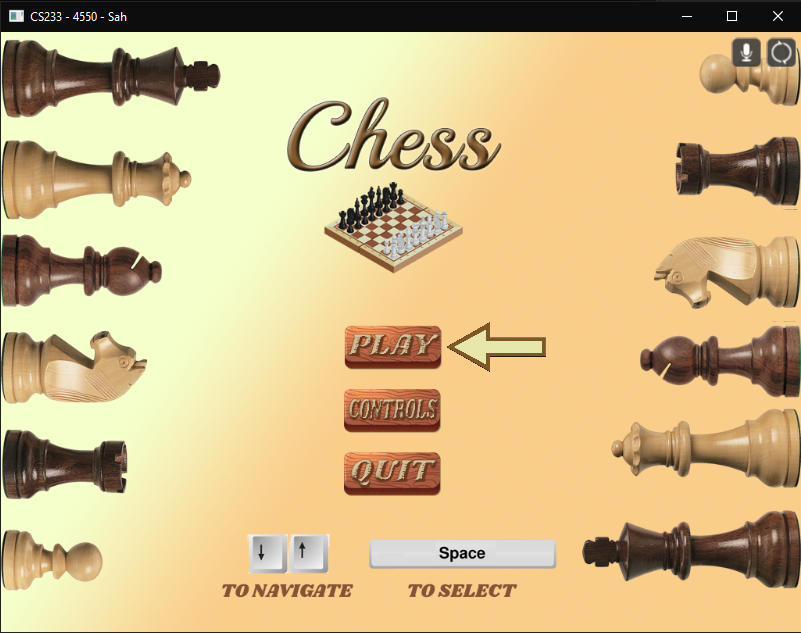
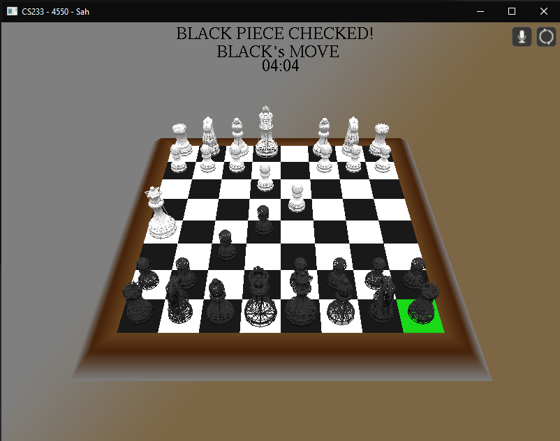
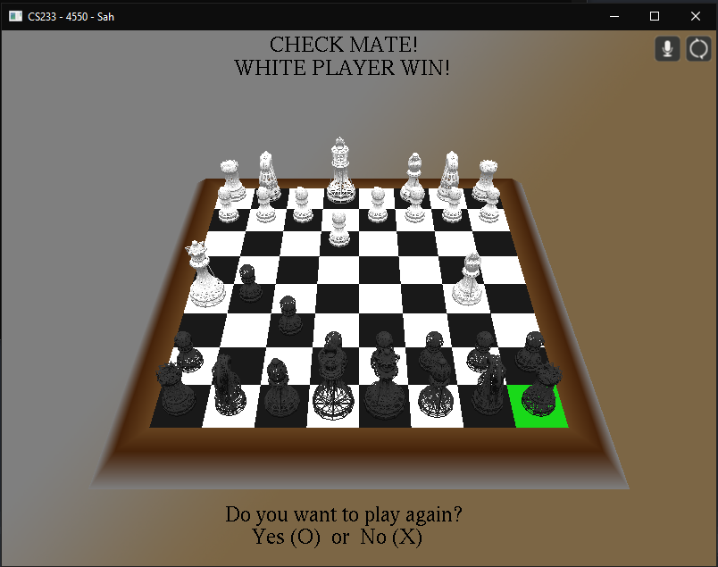

# Chess
The classic game of chess in 3D implemented in C++ using the OpenGL graphics library. It contains rendering of 3D models, images (sprites) and sound playing. The chess logic works as expected which is controlled by the keyboard. 

The models are drawn in a weird wireframe mode due to a bug in the model renderer. 

Pretty bad documentation i wrote for my uni course (in Serbian): 
[Documentation](CS233%20-%20Projektna%20dokumentacija.pdf)

## Main Menu

## Check

## Mate

